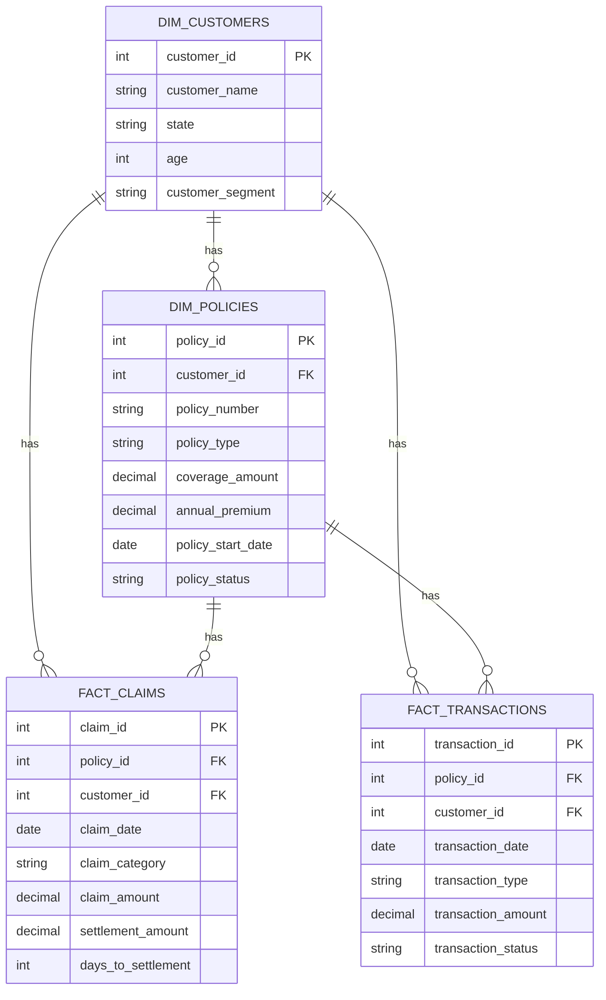

## Insurance Semantic Layer Implementation

## Project Overview

This project demonstrates an end-to-end semantic layer implementation using fake insurance data.

The goal is to transform raw insurance datasets into a clean dimensional model and provide consistent, business-friendly definitions that analysts can use without needing to understand the underlying raw data structure.

The project uses:

- dbt Core
- DuckDB
- SQL
- YAML
- CSV seed data

## Business Problem

Insurance analysts need to answer common underwriting and claims questions such as:

- What is the loss ratio by policy type?
- How many policies are currently active?
- What is the average claim settlement time?

The semantic layer provides consistent definitions for these business concepts so that analysts do not need to recreate the business logic independently.

## Architecture

The project follows this data flow:

```text
Raw CSV Files
      |
      v
dbt Seeds
      |
      v
Staging Models
      |
      v
Dimensional Marts
      |
      v
Business / Semantic Model
      |
      v
Analytical Queries
```

### Staging Layer

The staging layer cleans and standardizes the raw source data.

Models:

- `stg_customers`
- `stg_policies`
- `stg_claims`
- `stg_transactions`

### Mart Layer

The mart layer implements a dimensional model.

Dimensions:

- `dim_customers`
- `dim_policies`

Facts:

- `fact_claims`
- `fact_transactions`

| Model | Grain |
|---|---|
| `dim_customers` | One row per customer |
| `dim_policies` | One row per policy |
| `fact_claims` | One row per claim |
| `fact_transactions` | One row per transaction |
| `insurance_metrics` | One row per policy |

## Star Schema

The main relationships are:

- Customer → Policies
- Policy → Claims
- Policy → Transactions

Claims and transactions are intentionally not joined directly because both tables can contain multiple rows per policy.

For example, if a policy has two claims and three transactions, directly joining them could produce six rows and incorrectly duplicate financial amounts.

Instead, claims and premium transactions are aggregated to policy level before being combined in the business-facing model.

## Semantic / Business Layer

The `insurance_metrics` model provides a business-facing view of insurance performance.

Important fields include:

- `claim_count`
- `total_claim_amount`
- `total_settlement_amount`
- `total_premium`
- `avg_settlement_days`
- `loss_ratio`

The accompanying `semantic.yml` file documents the business meaning of these fields and tests the model grain.

This project uses a lightweight dbt + SQL semantic-layer approach rather than an external semantic engine.

## Metric Definitions

### Total Claim Amount

Sum of claim amounts associated with a policy.

### Total Settlement Amount

Sum of settlement amounts associated with a policy.

### Total Premium

Sum of completed premium-payment transactions.

### Claim Count

Number of claims associated with a policy.

### Active Policy Count

Number of policies where `policy_status = 'Active'`.

### Average Settlement Time

Average `days_to_settlement` for settled claims with a non-null settlement duration.

### Loss Ratio

For this project:

`Loss Ratio = Total Settlement Amount / Total Completed Premium Payments`

When reporting loss ratio across policy types, settlement amounts and premiums are summed before calculating the ratio.

## Assumptions

The source data is a small synthetic insurance dataset.

For this exercise:

1. Completed premium-payment transactions represent collected premiums.
2. Settlement amount is used as the loss amount in the loss-ratio calculation.
3. Policies without premium payments return a null loss ratio rather than dividing by zero.
4. Policies without claims receive zero claim and settlement amounts.
5. Policies without settled claims retain a null average settlement time.

Because the dataset is synthetic, some calculated loss ratios may not represent realistic insurance portfolio performance.

## Data Quality Tests

dbt tests validate that:

- Primary keys are unique.
- Primary keys are not null.
- Foreign keys are not null.
- Policy-to-customer relationships are valid.
- Claim-to-policy relationships are valid.
- Transaction-to-policy relationships are valid.
- `insurance_metrics.policy_id` remains unique and non-null.

The project currently contains 34 data tests.

## Example Business Results

### Active Policies

7 active policies.

### Average Claim Settlement Time

41.6 days.

### Loss Ratio by Policy Type

| Policy Type | Total Settlement | Total Premium | Loss Ratio |
|---|---:|---:|---:|
| Auto | 526,200 | 9,600 | 5,481.25% |
| Home | 36,000 | 8,000 | 450.00% |
| Life | 3,800 | 1,700 | 223.53% |

The high ratios reflect the synthetic source data and the metric definition used for this exercise.

## Running the Project

Install the required packages:

```bash
pip install dbt-core dbt-duckdb
```

Load the seed data:

```bash
dbt seed
```

Build the models:

```bash
dbt run
```

Run the data-quality tests:

```bash
dbt test
```

Compile the sample business queries:

```bash
dbt compile --select business_questions
```

## Project Structure

```text
insurance_semantic_layer/
├── analyses/
│   └── business_questions.sql
├── models/
│   ├── staging/
│   │   ├── stg_customers.sql
│   │   ├── stg_policies.sql
│   │   ├── stg_claims.sql
│   │   ├── stg_transactions.sql
│   │   └── staging.yml
│   ├── marts/
│   │   ├── dim_customers.sql
│   │   ├── dim_policies.sql
│   │   ├── fact_claims.sql
│   │   ├── fact_transactions.sql
│   │   └── marts.yml
│   └── semantic/
│       ├── insurance_metrics.sql
│       └── semantic.yml
├── seeds/
│   ├── raw_customers_2hr.csv
│   ├── raw_policies_2hr.csv
│   ├── raw_claims_2hr.csv
│   └── raw_transactions_2hr.csv
├── dbt_project.yml
└── README.md
```

## Design Rationale

The project separates raw-data cleanup, dimensional modeling, and business logic into distinct layers.

This makes the transformations easier to understand, test, maintain, and extend.

## Star Schema Diagram

